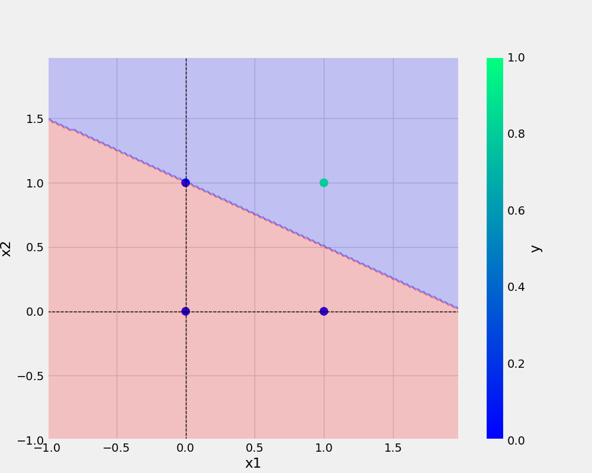

# oneNeuron_1
oneNeuron_1|Perceptron


# commands used -
###
* point 1
* point 2


1. point 1

'''bash
git add . && git commit  -m "docstring updated" && git push origin main
'''

'''bash

cp Research\ notebooks/demo.ipynb .
'''

## Add the URL-
[Git handbook](https://guides.github.com/introduction/git-handbook)

<a href="https://www.w3schools.com">Visit W3Schools.com!</a>

## Add the image -



## Python code

```python
def main(data , eta , epochs , filename, plotFileName):
  

    df = pd.DataFrame(data)
    print(df)
    X,y = prepare_data(df)
    
    model = Perceptron(eta = eta , epochs = epochs)
    model.fit(X,y)

    _ = model.total_loss()

    save_model(model, filename=filename)
    save_plot(df, plotFileName , model)
```    
## dataset


x1 | x2 | y
-|-|-
0|0|0  
0|1|0 
1|0|0 
1|1|1 


 AND = {
         "x1": [0,0,1,1],
         "x2":[0,1,0,1],
         "y":[0,0,0,1],
    }

